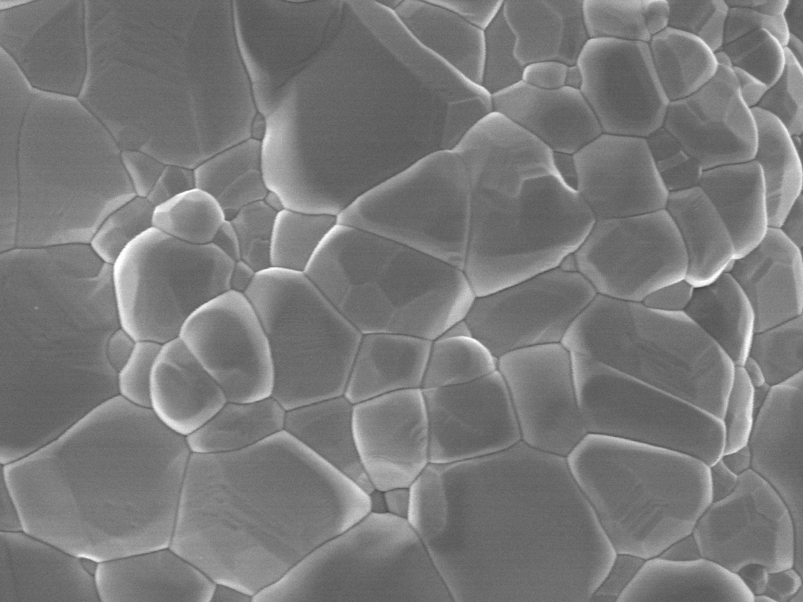
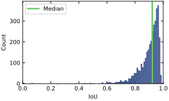
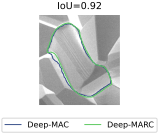
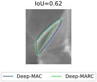
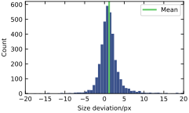
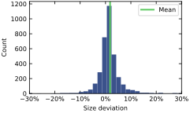

:toc:

= SemiAutomaticAnnotation

image:https://img.shields.io/badge/DOI-10.1016/j.actamat.2023.119106-blue.svg[DOI,link="https://doi.org/10.1016/j.actamat.2023.119106"]
image:https://img.shields.io/github/license/maxfrei750/SemiAutomaticAnnotation.svg[License: MIT,link="https://github.com/maxfrei750/SemiAutomaticAnnotation/blob/main/LICENSE"]
image:https://img.shields.io/github/license/tensorflow/tensorflow.svg[License: Apache-2.0, link="https://github.com/tensorflow/tensorflow/blob/master/LICENSE"]
image:https://img.shields.io/badge/platform-docker-blue[Platform: docker]

This browser-based application allows the pixel-perfect annotation of objects, by just labeling their bounding box. It can therefore
yield significant speed-ups of the annotation process, especially for irregularly shaped objects.

image::assets/images/demo.gif[Demo]

== Installation
. Install https://github.com/git-guides/install-git[Git].
. Install https://docs.docker.com/get-docker/[Docker].
. Install https://docs.docker.com/compose/install/[Docker Compose] (not needed on Windows).
. Open a command line.
. Clone this repository: `git clone https://github.com/maxfrei750/SemiAutomaticAnnotation.git`
. Change into the repository folder: `cd SemiAutomaticAnnotation`
. Build the required Docker images (this might take some time): `docker compose build`

== Usage
. Place your input images in the `./SemiAutomaticAnnotation/data/input` folder.
. Open a command line.
. Change into the repository folder: `cd SemiAutomaticAnnotation`
. Start the application (might take a few seconds): `docker compose up`
. Visit the web application: http://localhost:8502
. Annotate your images.
. Evaluate your images.
. Inspect your results.
. Take your results from the `./SemiAutomaticAnnotation/data/results` folder.

== Update
. Open a command line in the repository folder.
. Pull the latest version: `git pull`
. Rebuild the Docker images: `docker compose build`

== Acknowledgement
This application is based on the following publication:

https://arxiv.org/abs/2104.00613[Birodkar et al. -- The surprising impact of mask-head architecture on novel class segmentation]

The authors of this application and the aforementioned publication are not associated in any way.

== Deep-MAC versus Deep-MARC
Birodkar et al. proposed two models, Deep-MAC (Deep Mask-heads Above CenterNet) and Deep-MARC (Deep Mask-heads Above R-CNN). In this application, you can choose between the two models, however, for most particle analysis applications, they produce very similar results.

We compared the two models on a dataset of 32 grain images (with 3500+ grains) like the following one:



The resulting masks were compared using the intersection over union (IoU) metric and by comparing their sizes.

=== IoU
The IoU is defined as the area of the intersection of the masks divided by the area of the union of the masks. The following figure shows a histogram of the IoU values for pairs of masks, produced by the two models.



The median IoU is 0.92 and 99% of the IoU are larger than 0.62, which indicates a high similarity between the masks produced by the two models. As an illustration, the following figures show corresponding IoU values.

 

=== Grain size
For this comparison, we used the square root of the number of pixels in the mask as a measure for the grain size. The following figures show histograms of the absolute (left), as well as relative (right) deviations of grain sizes between the two models:

 

The deviations were calculated as follows:

	size_deviation_absolute = size_deep_marc - size_deep_mac
	size_deviation_relative = size_deviation_absolute / size_deep_mac

== Licenses

=== Model
https://github.com/tensorflow/tensorflow/blob/master/LICENSE

=== Application
https://github.com/maxfrei750/SemiAutomaticAnnotation/blob/master/LICENSE

== Citation
If you use this repository for a publication, then please cite it using the following bibtex-entry:
```
@article{Gorynski.2023,
	title = {Machine Learning Based Quantitative Characterization of Microstructures},
	author = {Gorynski, Claudia and Frei, Max and Kruis, Frank Einar and Winterer, Markus},
	year = {2023},
	journal = {Acta Materialia},
	volume = {256},
	pages = {119106},
	issn = {1359-6454},
	doi = {10.1016/j.actamat.2023.119106},
}
```

== For developers
=== Enable debugger in VSCode
. Create a file named `.env` in the repository folder.
. Add the following content to the file:
   DEBUGGER=1
. Optional: Stop running containers.
. Start containers: `docker compose up`
. Attach to the debugger by using the run configuration `Python: Remote Attach` in VSCode.
. Set breakpoints and start debugging.
